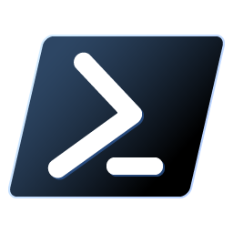
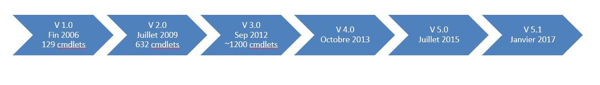

<!-- author: Yves Campmas -->
<!-- header: Windows Powershell-->

# Presentation and history

Powershell Course #1

---

# Summary

- What is Windows Powershell ?
- Why ?
- Evolution of Powershell
- Powershell Core

---

# Presentation Teacher

- I'm Yves Campmas
- Work for different mission in Airbus
- Freelance for 4 years
- Currently at DevOps SRE Team

---

# What is Windows Powershell ?

- Comand-line shell & Script language by Microsoft
- First release was November, 14th 2006
- based on Microsoft .Net Technology
- Evolution of VBScript and batch files
- Object-Oriented

---

# Why ?

- Simplify IT administrative tasks (automate)
- build tools (to delegate for example)
- Very easy, even for no developpers
- Many commandlets available
- Advanced script also available

---

- Integrated in many products
  - Azure
  - Exchange
  - SQL Server
  - Active Directory
  - ... And some tiers products !

---

# Evolution of Windows Powershell

These lists are not exhaustive ! it is just major features

---

## Powershell v1.0

- Optional component on Windows Server 2008/Vista
- Very Basic

---

## Powershell v2.0

- Installed by default on Windows Server 2008R2 / Seven
- Remote Powershell
- Modules
- Transactions
- ISE
- etc.
  
---

## Powershell v3.0

- Installed by default on Windows Server 2012/Windows 8
- Desired State COnfiguration
- Powershell Web Access
- Robust Session
- New modules to manage the windows system
- Scheduled jobs
- etc.

---

## Powershell v4.0

- Installed by default on Windows Server 2012R2/Windows 8.1
- Desired State Configuration
- Many little features and improvment

---

## Powershell v5.0

- PowershellGet
- Create Class and Enum (about_classes)
- Pester module integrated

## Powershell v5.1

- Last version of Windows Powershell
- Installed by default on Windows Server 2016 and +

---

## Why it is important to know version ?

- Deploy the script on your Windows Servers
- Each version compatible with previous versions
- Check the version : $host.version.major
- You can upgrade Windows Powershell with WMF "Windows Management Framework"
- Any doubt, check version in your script !

---

# And Powershell core ?

- Begining with the version 6.0 (January 2018)
- Based on .Net Core
- Multi-Platform (Linux, Mac OSX and Windows)
- Open source

---

# How install Powershell Core ?

- Powershell Core is not installed by default
- You need to install MSI Package
https://docs.microsoft.com/fr-fr/powershell/scripting/install/installing-powershell-on-windows?view=powershell-7.2

---

# Windows or Core ?

- It depends !
- Beginning and no manage Windows infra : Core
- You are in Azure/Office 365 : Core
- Manage Windows Infra (server or workstation) : Windows
- In this course, we will focus on Windows Powershell

---

Any questions ?

---

# Link

- https://learn.microsoft.com/fr-fr/events/powershell-team-powershell-10-year-anniversary/powershell-evolution

- https://docs.microsoft.com/fr-fr/powershell/scripting/whats-new/differences-from-windows-powershell?view=powershell-7.2