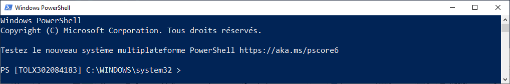
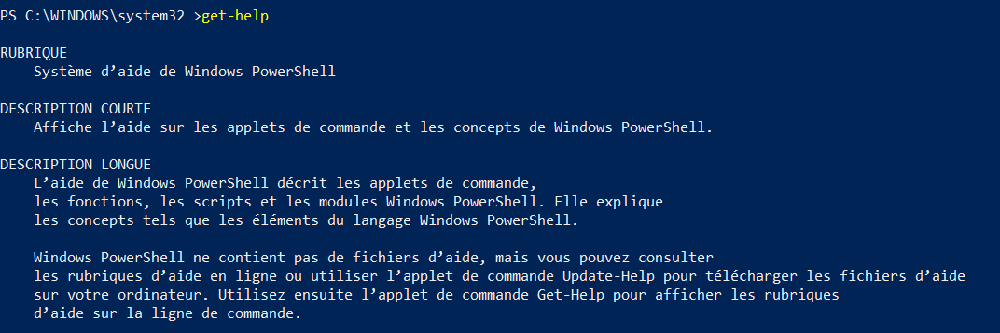

<!-- author: Yves Campmas -->
<!-- header: Windows Powershell Basics-->

# Windows Powershell Basics

---

# Summary

- Start Windows Powershell
- Cmdlet and Alias
- Profile
- Variable
- Provider

---

## Start Windows Powershell

Start > type Powershell > click Windows Powershell



Integrated from Windows 7 by default

---

## Cmdlet

- Cmdlet = Powershell command

```powershell
<Verb>-<Noun>
```

example :

```powershell
Get-Process
Set-TimeZone
Get-Date
```

---

## Alias

- Shortcut to a cmdlet or other command

Some example :

cd --> Set-Location
dir --> Get-ChildItem
curl --> Invoke-WebRequest

BE CAREFUL ! curl is not curl.exe

---

## Some useful cmdlets

---

### Get-Command

- Get every command available in your session
- cmdlet, alias, but also application
- Possibility to Filter by verb or noun


---

### Get-Help

- Get the help for each cmdlet
- "man" it is the equivalent in Linux OS
- Contains synopsis, syntax, description, examples



---

### Get-Member

- alias : "gm"
- Get properties and methods of your object
- Very useful to know every possibilities


---

### Get-Process

- alias : "ps"
- Get every process in your computer
- Like task manager, but in your shell

---

### Show-command

- Show the possibility of your cmdlet in GUI
- Perfect for the beginner


---

After, you can discover many other command in your different futur script.

Powershell already have many Cmdlet available...

---

## Console

---

- powershell.exe will launch a console


---

- Some edition shortcut

Tabulation --> Autocompletion
CTRL + C --> Stop execution
CTRL + S --> Pause execution
up/down arrow --> move in your history

or to have all your keyboard shortcut

```powershell
Get-PSReadLineKeyHandler
```

---

### History

You can manage the history with the cmdlet noun **History**

Don't forget to clear your history... it is good security practice :)

```powershell
Clear-History
```

---

### Profile

- Personalize your console environment
- You can specify scope (current/all User or Host(=console))
- Add script, alias, prompt etc.

---

example:

```powershell
notepad.exe $profile
```

add:

```powershell
function prompt {"PS [$env:COMPUTERNAME] $pwd >"}
```

close and open powershell.exe


---

Question ?

---

## Variable

---

- Store all types of values
- Unit of memory where the data is stored temporarly
- begin by $
- $<name of your variable> = <value>

example to create a string variable:

```powershell
$company = "Airbus"
$MyProcess = Get-Process
```

---

- Variable are case insensitive

```powershell
$AIRBUS = $airbus
```

- Contains only alphanumeric characters and underscore
- Powershell automatically chooses the data type during the initialization

```powershell
$MyNumber = 2
# 2 is a integer
$MyNumber = "2"
# 2 is a string
```

- You can work with cmdlet *-Variable

---

- Possible to specify the type of your variable
- Put [<type>] just before the variable name

```powershell
[string]$MyFavoriteNumber = 7
# 7 is a string
```

Some variables are predefined

\$? --> know the well result of the last command (true or false)
\$True/\$False --> booleans True or False
\$Error --> array with the error list in your current session
\$PSScriptRoot --> Get the location of your script

---

- Environment variable are also available in Powershell
- Dynamic variable used by systems and many processes
- Begin by $env:

Example :

```powershell
$env:Username # Current user
$env:ComputerName # Name of your machine
$env:USERDOMAIN # AD Domain of your use
```

---

You have some cmdlet to manage your variable

```powershell
New-Variable -Name "Company Name" -Value Airbus -Description "Name of the company" -Option ReadOnly
# Create a variable with a space read only
```

```powershell
Get-Variable 'Company Name'

Name                           Value
----                           -----
Company Name                   Airbus
```

It is not advise to use space in your variable name.

---

## Provider

---

*Ok... But why we have **get-item** and not **get-file** ?*

---

- Powershell adaptator
- Navigate like "File System" in CLI
- The same cmdlet "Core" available
- Sometime, you have dedicated cmdlet
- Third party available (example: AD, SQL Server)

---

- It is like a hierarchy

```Powershell
<DRIVE>:<Path>
````

Example

```Powershell
C:\Users
HKLM:\System
Env:
AD: DC=EU,DC=Airbus,DC=Corp
````

---

### cmdlets for providers

- Some cmdlet *-PSProvider
  - Manage your PSProvider
- Many generic cmdlet available for all PSProviders
  - *-Item
  - *-ItemProperty
  - *-Location

---

Example :

Get-PSProvider

| Name | Provider | Root |
|---|---|---|
| Alias | Microsoft.PowerShell.Core\Alias | |
| C | Microsoft.PowerShell.Core\FileSystem | C:\ |
| Cert | Microsoft.PowerShell.Security\Certificate | \ |
| D | Microsoft.PowerShell.Core\FileSystem | D:\ |
| Env | Microsoft.PowerShell.Core\Environment | |
| Function Microsoft.PowerShell.Core\Function | |
| HKCU | Microsoft.PowerShell.Core\Registry | HKEY_CURRENT_USER |
| HKLM | Microsoft.PowerShell.Core\Registry | HKEY_LOCAL_MACHINE |
| I | Microsoft.PowerShell.Core\FileSystem | I:\ |
| O | Microsoft.PowerShell.Core\FileSystem | O:\ |
| P | Microsoft.PowerShell.Core\FileSystem | P:\ |
| Variable | Microsoft.PowerShell.Core\Variable |  |
| WSMan | Microsoft.WSMan.Management\WSMan |  |
---

Change location

````powershell
PS I:\ > Set-Location c:\temp
PS C:\temp >
````

Create Environment Variable

````powershell
PS Env:\ >New-Item -Name MyGlobalVariable -Value Airbus

Name                           Value
----                           -----
MyGlobalVariable               Airbus
````

---

Question ?

---

Some link :
https://docs.microsoft.com/en-us/powershell/module/microsoft.powershell.core/about/about_providers?view=powershell-5.1
https://learn.microsoft.com/en-us/powershell/module/microsoft.powershell.core/about/about_scopes?view=powershell-5.1