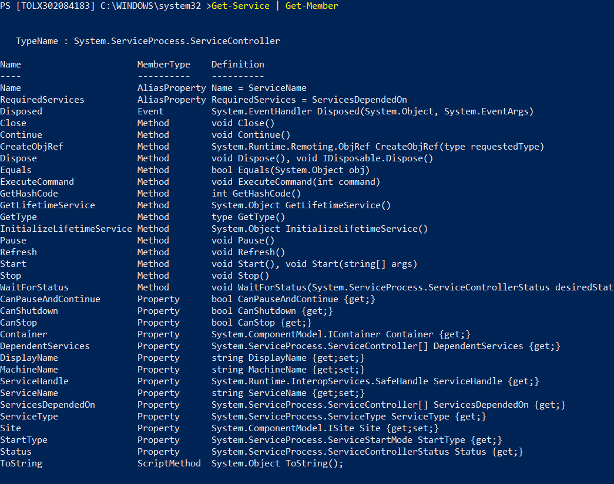

<!-- author: Yves Campmas -->
<!-- header: Objets with Powershell-->

# Objets with Powershell

---

## What is an object in PowerShell ?

---

The objects have 2 important concepts :

- Class : It is the constructor of your object or "blueprint"
- Object : It is an instance

---

Your object contains :

- Property : Object features
- Method : Object action

---

Example :


---

What define the airplane ?

Members !

- Properties
  - Color
  - Engine
  - jet or propeller plane
  - number seats
- Methods
  - Take off / landing
  - speed up
  - turn

---

***So... Everythings are objects !***

---

- Properties + Methods = Members
- Call members with "dot" notation
  - $MyAirplane.Engine --> Know the value of Engine property
  - $MyAirplane.Speedup() --> Accelerate the airplane

---

- Don't need to know every members...
- You can use
    **Get-Member**
- You also can use the method .gettype() to know the type
- And Microsoft Documentation

---

Demonstration :


---

Question ?

---

## Pipeline

---

- Commands connected by the pipeline operator
- Result cmdlet send to next cmdlet
- Already very used in other environment (like Bash)
- You can connected many commands

````powershell
    command1 | Command2 | Command3
````

---

Example :

````powershell
Get-Process -Name chrome | Stop-Process
````

The first command will take processes "chrome" and send the object to the cmdlet Stop-Process to stop this process

---

- Manage the display of your result with cmdlet format-*
- Format-Table is used by default
- Format-List is another cmdlet to have properties list by object
- DON'T USE IN YOUR SCRIPT "Format-*" cmdlet !

---

## Array

---

- An array is a object list
- It is a data structure which stores a collection of elements.
- So Array = list
- Values are added one by one, like a sequence
- An Array can accept any type

---

- Initialize an array

````powershell
$array = @()
````

- Create an array with some value

````powershell
$array = @("one","two","three")
````

- You can add value in the array

````powershell
$array += "four"
````

---

- An array is ordered by index
- You can access with the index (begin at 0)

````powershell
$array[0]
````

- Modify the value for one element

````powershell
$array[2] = 5
````

---

- You need to have the members for all element of array :

$array | Get-Member

- You need to have the members for array list :

,$array | Get-Member

---

- Different array = hashtables
- Need to use a key, not an index

````powershell
# Initialize Hash table
$hastable = @{}
# Initalize Hash table with value
$hashtable = @{'Avion1'='A320';'Avion2'='A350'}
````

- Be careful : each key need to be unique !

---

## Objects manipulation

---

- Create your first object powershell !
- You just need to use the type PSCustomObject
- It is very easy, but you have different ways

Example :

````powershell
$myairplane = [PSCustomObject]@{
    Brand = "Airbus"
    Model = "A320"
}

$myairplane.Brand
Airbus
````

---

- After, you can manage this object as you want

````powershell
# add new property
$myairplane | Add-Member -MemberType NoteProperty -name "ID" -value 1
$myairplane

Brand  Model ID
-----  ----- --
Airbus A320   1

# add new property dynamic
$myairplane | Add-Member -MemberType ScriptProperty -name "Date_execution" -value {get-date}
$myairplane

Brand  Model ID Date_execution
-----  ----- -- --------------
Airbus A320   1 09/08/2022 17:27:08
````

---

### Objects in the cmdlets

- When you perform cmdlets, you have very many times a array with different objects
- So you need to manage it as an array
- *-object cmdlets are very useful to manage the objects

Example :

````powershell
$processes = get-process
$processes.gettype()

IsPublic IsSerial Name                                     BaseType
-------- -------- ----                                     --------
True     True     Object[]                                 System.Array
````

---

### Objects cmdlet very useful

**Foreach-Object** : Execute the same operation for each object send by pipeline

- it is a while
- Alias : foreach and %
- $_ it is a special variable to get the current object

````powershell
Get-Process | foreach-object {"It is my process $($_.name) with id $($_.id) "}
Get-Process | % {"It is my process $($_.name) with id $($_.id) "}
````

---

**Where-Object** : Filter the object send by pipeline

- Alias : while and ?
- As Foreach-object, you need to use variable $_

````powershell
# get only services running
Get-Service | Where-Object {$_.Status -eq "Running"}
Get-Service | ? {$_.Status -eq "Running"}
````

---

Select-object

- Select the objects with the property that you want
- Very usefull in Powershell script to create new object

````powershell
# get the 10 first process and select only property Name and Id
Get-Process | Select-Object -first 10 -Property "Name","Id"
````

---

Links :
- https://docs.microsoft.com/fr-fr/powershell/scripting/learn/deep-dives/everything-about-pscustomobject?view=powershell-5.1
- https://docs.microsoft.com/en-us/powershell/module/microsoft.powershell.core/foreach-object?view=powershell-5.1

---
