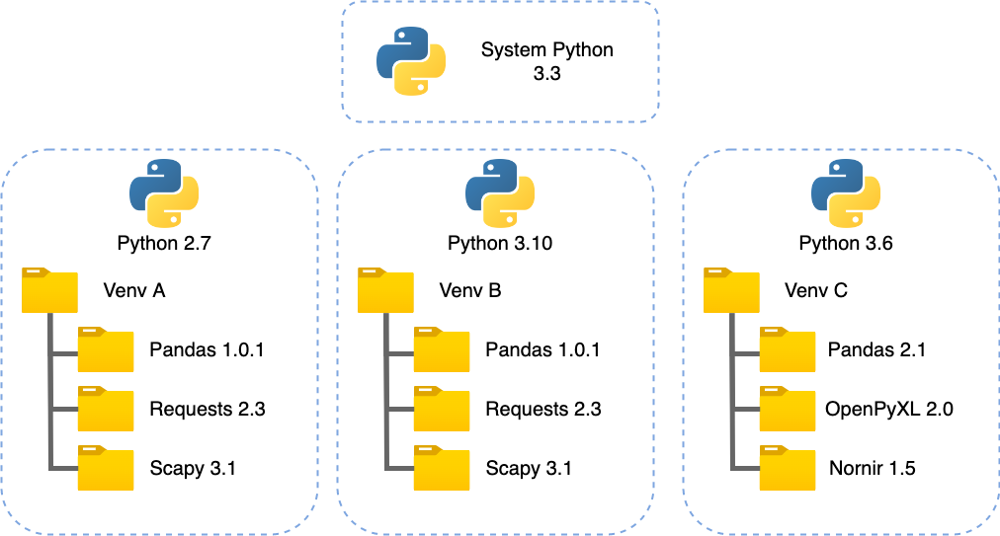

**Airbus CyberDiploma will use  [conda](https://docs.conda.io/en/latest/) for environments** 

The interested reader can check the following links to better understand the differents choices: 

* https://dev.to/bowmanjd/python-tools-for-managing-virtual-environments-3bko
* https://aseifert.com/p/python-environments/


#### What is a virtual environment ?

Python by default install modules system wide. That can become an issue if programs need different versions of the same module.

The solution for this problem is to create a [virtual environment](https://docs.python.org/3/glossary.html#term-virtual-environment), a self-contained directory tree that contains a Python installation for a particular version of Python, plus a number of additional packages.





#### Creating Environments

We are going to create environments using the conda commands. 
You can first start Miniforge and run the 
'''
conda init powershell
'''


```
conda create -n tutorial-env python=3.11
```

> **_NOTE:_**  You can of course name your environment with something else than "myenv".


Once created, you can activate your conda environment by running

```
conda activate tutorial-env
```

You're now free to go !

```
python
import sys
sys.path
```

