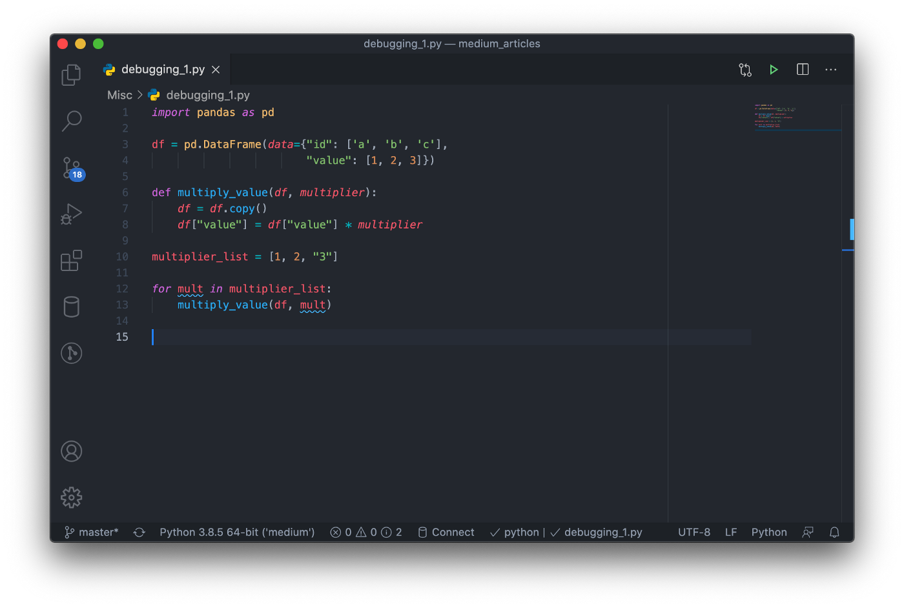
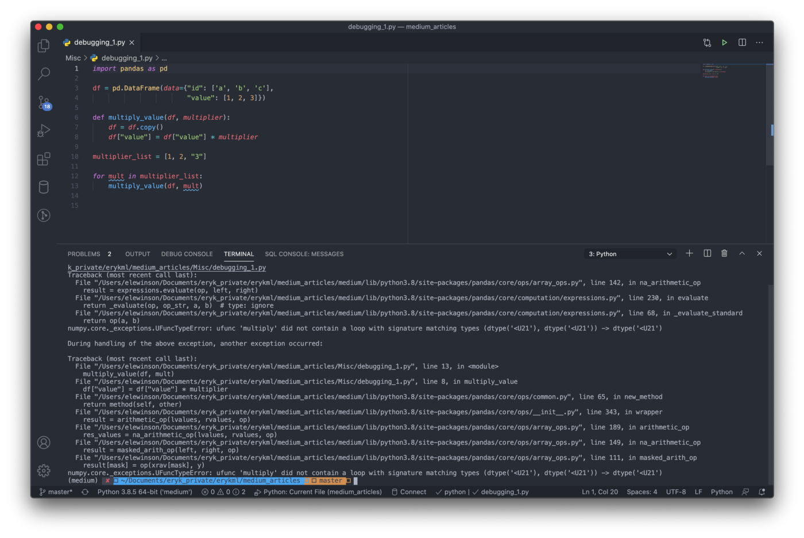
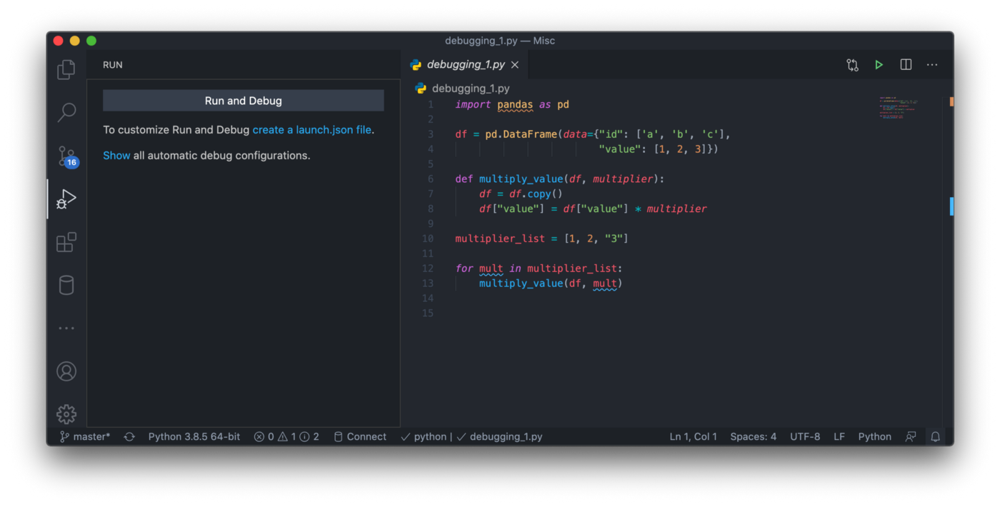
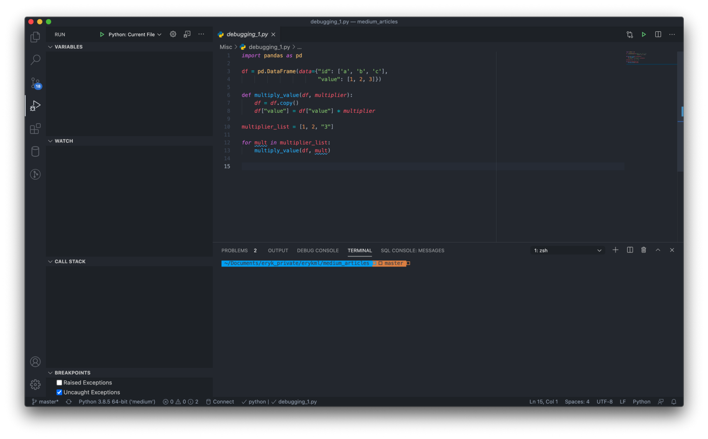
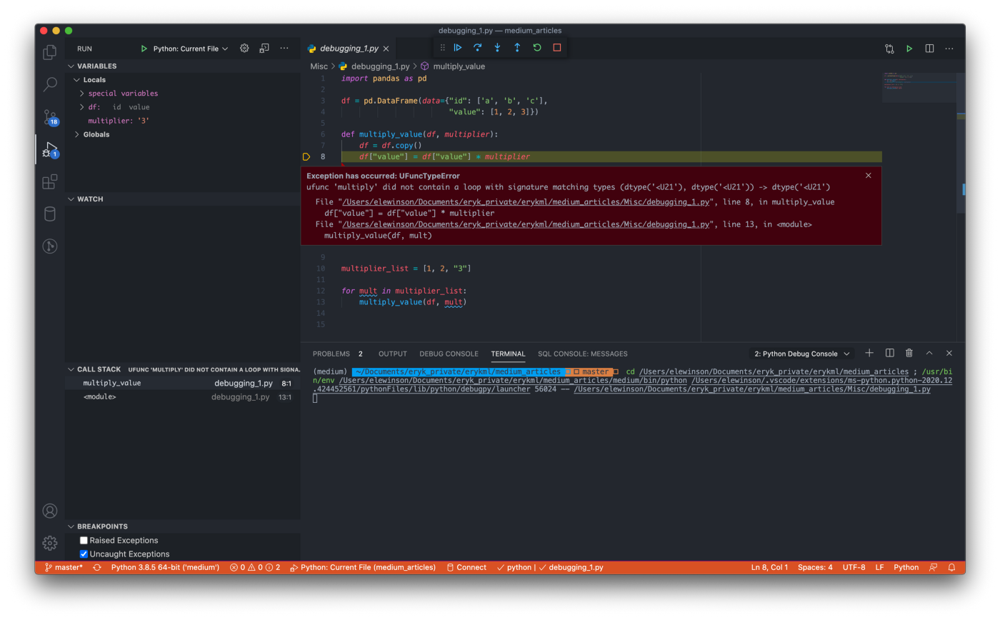
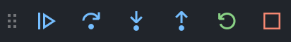
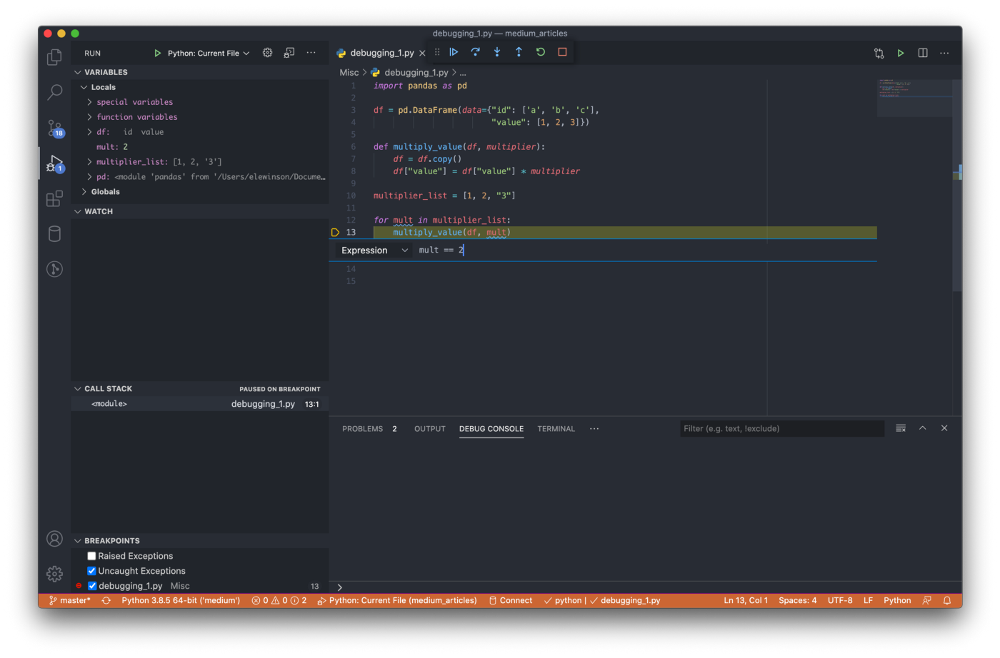
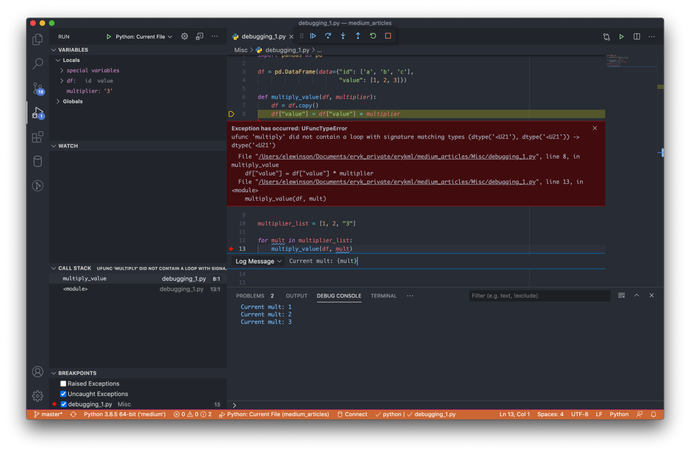

# Debugging in VS Code

## The basics

Let’s dive right into the debugging. First, we need to write some code. The  simple script you can see below will do the work. Of course, it’s a  great oversimplification of the scripts you will most likely work with,  but it’s good enough for demonstration. You can also see what is wrong  there and when the code will actually throw an error straight away.

```python
import pandas as pd

df = pd.DataFrame(data={"id": ['a', 'b', 'c'],
                        "value": [1, 2, 3]})

def multiply_value(df, multiplier):
    df = df.copy()
    df["value"] = df["value"] * multiplier

multiplier_list = [1, 2, "3"]

for mult in multiplier_list:
    multiply_value(df, mult)
```


The first step is just to open the VS Code, navigate to a directory where  we want to set up our project, create a new script, and paste in the  code from the Gist above. You should see something like this:



Then, we can run the script in the terminal by pressing the green play button in the top right corner of the window (or right-click somewhere in the  editor pane and select “Run Python File in Terminal”). We can see the  result in the screenshot below. Clearly, something went wrong (the log  is capped a bit, so there is more of the traceback there).



We can either try to figure it out from here or just jump right into  debugging. To do so, press the “play with bug” icon on the left and you  will see the following screen. We will get back to the debug  configuration later on, but for now just go ahead and press “Run and  Debug”.



After starting debugging, we will see the following screen.



Quite a few things are new here, so I will try to provide some clarity by pointing to certain parts of the screen:

**Variables Pane** — here we can easily inspect the variables which are created while  running the script. We can see all the variables together with their  current values. So in the case of running our script, we will see the  DataFrame `df`, the `multiplier_list`, the current value of `mult`, etc. In this pane, we will also see the distinction between global and  local variables. The latter ones will be the ones that are available  within a limited scope (for example, in the function). An example of the local variable will be `multiplier`, as it is only available within `multiply_value()` and it is not available outside of the function (globally).

**Watch Pane** —we can use this pane as a subset of the variables pane. It can happen  that our program has tens or hundreds of variables, but we are only  interested in some of them. Then, we can add those selected variables to the watch pane by clicking on the + icon when we hover over the pane.  This way, we can easily monitor their values.

**Call Stack Pane** — this pane is especially helpful when the code we are debugging has a  lot of inner methods. With the help of the call stack pane, we can  navigate deep inside a [stack](https://en.wikipedia.org/wiki/Call_stack) and precisely identify from which one the error came from.

**Breakpoints** — in general, **breakpoints** are a very important concept while debugging. When we run our script  without specifying any breakpoints, it will stop at the line which  causes the error (or execute the entire script if there are no errors).  However, we might also want to stop the program earlier and inspect the  state of the variables at that particular point. To do so, we can place a breakpoint by clicking to the left of the line number in the editor and the created breakpoint will be indicated by a red dot. When running the script with breakpoints, it will stop at each of them and wait for our  further commands. There are also a few different kinds of breakpoints in VS Code, but I will get back to it later.

OK, this was quite a lot. Even though it might seem daunting at first, it  will all become clear with some practice. For now, just go ahead and  press the green play button to start debugging (you might need to select “Python: Current File” here).



We can see that the panes filled with information as expected. Also, the  error popped up at the screen in the place it occurred, together with  its type and some additional information. This already helps a lot in  identifying the cause. Let’s take a look at the variables pane,  especially the local variables, as the error occurred within a function. There, we can see that `multiplier` has a value of `“3”`, while it should be something numeric for the multiplication to work.  Great success, even though we knew it from the beginning. While it was  really simple in this case, as we defined the list ourselves, in more  complex scripts it can be really easy to lose track of what each  variable is storing. Especially when the values are filled from  somewhere, for example, a database.

At the same screen, we can also see something new, namely the **debug toolbar**.



It is the main toolbar that allows us to navigate along with the code as we  attempt to debug it. The icons represent the following actions:

- Continue/Pause — pause or continue the debugging process
- Step Over— move over to the next line of code
- Step Into — enter inside a different method during debugging
- Step Out — move to the parent stack
- Restart — restarts the debugging session
- Stop — stops the debugging session

The last crucial thing to cover is the **debug console**. In contrast to the terminal, where we can just see whatever we are  printing/logging and the error message if the script breaks, in the  debug console we can work interactively and explore variables. Whenever  the debugger hits a breakpoint or an error occurs, in the debug console  we can execute commands at that very step and with the current state of  the variables. In the image below, we can see that we checked the  current value of the `mult` variable, printed the `df` and checked if we can actually multiply the column by 3.


This functionality comes in very handy when the script breaks and we are not entirely sure what happened and if the solution we came up with  actually works. For example, we could run the following in the debug  console:

```
df[“value”] * “3” 
```

and observe the same error we have encountered before. But if we run:

```
df[“value”] * 3
```

there will be no error and we will get what we actually wanted in the first place.

This should be enough to get started and debug your own scripts. However,  there are two more topics that I think can be really nice to know and  help while debugging some more complex cases.

## Types of breakpoints

VS Code offers three types of breakpoints, each with a different purpose.  To select them, we first create a normal breakpoint, and then  right-click it and select “Edit Breakpoint…”. Below, I describe the  characteristics of each kind of breakpoint:

- **Expression** — the breakpoint will trigger and stop the code’s execution when the  condition is met. In the image below, we set the condition to be `mult == 2`. In the variables pane, we can indeed see that the code stopped execution when the condition was met. Additionally, the *expression breakpoint* is characterized by having “=” in its red dot.



- **Hit Count** — this kind of breakpoint stops the code’s execution when it is triggered X times. For example, we can put this breakpoint inside the for loop  and specify its value to 2. By doing so, the code will be stopped in the very same place as the *expression breakpoint* above.
- **Log Message** — in contrast to the previous two types of breakpoints, this one does not stop the execution of the code. It can be used for printing out some  message to the log in the debug console. We have specified the message  to be `Current mult: {mult}` and it  was indeed printed in the console. Note that the expression to be  evaluated from the code (a variable) needs to be placed in curly  brackets. As we can see, the execution of the code has not been broken  before the expected error happened.



The last thing to know is that you can temporarily disable a breakpoint by right-clicking it and selecting “Disable Breakpoint”.

## Debugging config file

The debugging configuration drives VS Code’s behavior during a debugging session. The configuration is defined in a `launch.json` file that is stored in the `.vscode` folder in our workspace. To access the JSON file, we can either click  the “create a launch.json file” when first opening the debugging window  in VS Code, or just by clicking the “gear” icon next to the green play  button used for starting the debugging session.

What can we do using the config file? One example that often comes in handy  is setting the environment variables. Imagine that our code is deployed  and ran using some scheduler, for example, Airflow (it is much more than that, but for now let’s assume such a simplification is acceptable).  Then, we use a set of env variables to control the behavior of the  scripts. For example, in an ETL script we can use the env variable to  control if we want to scale the features or not.

When we are trying to debug that code locally, we will not have those env  variables in our system, as they are handled by Airflow. So one option  is to add those globally, but it can lead to a mess later on.  Alternatively, we can use the `launch.json` config file to provide a set of env variables to the debugging environment.

To do so, we press the “gear” icon to open the file and modify it by adding the contents of line 10.

```json
{
    "version": "0.2.0",
    "configurations": [
        {
            "name": "Python: Current File",
            "type": "python",
            "request": "launch",
            "program": "${file}",
            "console": "integratedTerminal",
            "env": {"RUN_TYPE": "prod"},
        }
    ]
}
```

When we run the next debugging session, we can directly access the `RUN_TYPE` env variable, for example, by running the following two lines:

```
import osprint(os.environ['RUN_TYPE'])## prod
```

