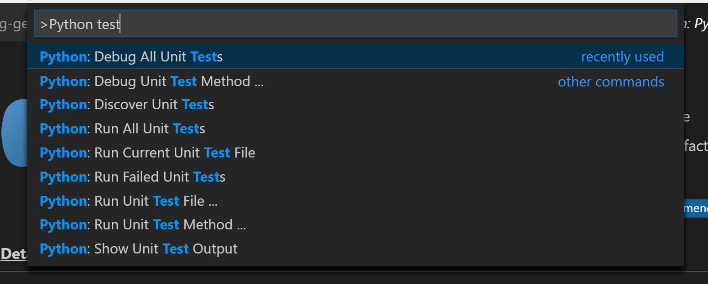

This file is an extract of [Real Python : Getting Started With Testing in Python](https://realpython.com/python-testing/). Fell free to read it completly there when you feel ready to.

## Testing Your Code

There are many ways to test your code. In this tutorial, you’ll learn the techniques from the most basic steps and work towards advanced  methods.

### Automated vs. Manual Testing

The good news is, you’ve probably already created a test without  realizing it. Remember when you ran your application and used it for the first time? Did you check the features and experiment using them?  That’s known as **exploratory testing** and is a form of manual testing.

Exploratory testing is a form of testing that is done without a plan. In an exploratory test, you’re just exploring the application.

To have a complete set of manual tests, all you need to do is make a  list of all the features your application has, the different types of  input it can accept, and the expected results. Now, every time you make a change to your code, you need to go through every single item on that  list and check it.

That doesn’t sound like much fun, does it?

This is where automated testing comes in. Automated testing is the  execution of your test plan (the parts of your application you want to  test, the order in which you want to test them, and the expected  responses) by a script instead of a human. Python already comes with a  set of tools and libraries to help you create automated tests for your  application. We’ll explore those tools and libraries in this tutorial.

### Unit Tests vs. Integration Tests

The world of testing has no shortage of terminology, and now that you know the difference between automated and manual testing, it’s time to  go a level deeper.

Think of how you might test the lights on a car. You would turn on the lights (known as the **test step**) and go outside the car or ask a friend to check that the lights are on (known as the **test assertion**). Testing multiple components is known as **integration testing**.

Think of all the things that need to work correctly in order for a  simple task to give the right result. These components are like the  parts to your application, all of those classes, functions, and modules  you’ve written. 

A major challenge with integration testing is when an integration  test doesn’t give the right result. It’s very hard to diagnose the issue without being able to isolate which part of the system is failing. If  the lights didn’t turn on, then maybe the bulbs are broken. Is the  battery dead? What about the alternator? Is the car’s computer failing?

If you have a fancy modern car, it will tell you when your light bulbs have gone. It does this using a form of **unit test**.

A unit test is a smaller test, one that checks that a single  component operates in the right way. A unit test helps you to isolate  what is broken in your application and fix it faster.

You have just seen two types of tests:

1. An integration test checks that components in your application operate with each other.
2. A unit test checks a small component in your application.

You can write both integration tests and unit tests in Python. To write a unit test for the built-in function `sum()`, you would check the output of `sum()` against a known output. 

For example, here’s how you check that the `sum()` of the numbers `(1, 2, 3)` equals `6`:

```
>>> assert sum([1, 2, 3]) == 6, "Should be 6"
```

This will not output anything on the REPL because the values are correct.

If the result from `sum()` is incorrect, this will fail with an `AssertionError` and the message `"Should be 6"`. Try an assertion statement again with the wrong values to see an `AssertionError`:

```
>>> assert sum([1, 1, 1]) == 6, "Should be 6"
Traceback (most recent call last):
  File "<stdin>", line 1, in <module>
AssertionError: Should be 6
```

In the REPL, you are seeing the raised `AssertionError` because the result of `sum()` does not match `6`.

Instead of testing on the REPL, you’ll want to put this into a new Python file called `test_sum.py` and execute it again:

```
def test_sum():
    assert sum([1, 2, 3]) == 6, "Should be 6"

if __name__ == "__main__":
    test_sum()
    print("Everything passed")
```

Now you have written a **test case**, an assertion, and an entry point (the command line). You can now execute this at the command line:

```
$ python test_sum.py
Everything passed
```

You can see the successful result, `Everything passed`.

In Python, `sum()` accepts any iterable as its first argument. You tested with a list. Now test with a tuple as well. Create a new file called `test_sum_2.py` with the following code:

```
def test_sum():
    assert sum([1, 2, 3]) == 6, "Should be 6"

def test_sum_tuple():
    assert sum((1, 2, 2)) == 6, "Should be 6"

if __name__ == "__main__":
    test_sum()
    test_sum_tuple()
    print("Everything passed")
```

When you execute `test_sum_2.py`, the script will give an error because the `sum()` of `(1, 2, 2)` is `5`, not `6`. The result of the script gives you the error message, the line of code, and the traceback:

```
$ python test_sum_2.py
Traceback (most recent call last):
  File "test_sum_2.py", line 9, in <module>
    test_sum_tuple()
  File "test_sum_2.py", line 5, in test_sum_tuple
    assert sum((1, 2, 2)) == 6, "Should be 6"
AssertionError: Should be 6
```

Here you can see how a mistake in your code gives an error on the  console with some information on where the error was and what the  expected result was.

Writing tests in this way is okay for a simple check, but what if  more than one fails? This is where test runners come in. The test runner is a special application designed for running tests, checking the  output, and giving you tools for debugging and diagnosing tests and  applications.

### Choosing a Test Runner

There are many test runners available for Python. The one built into the Python standard library is called `unittest`. In this tutorial, you will be using `unittest` test cases and the `unittest` test runner. The principles of `unittest` are easily portable to other frameworks. The three most popular test runners are:

- `unittest`
- `nose` or `nose2`
- `pytest`

**Airbus CyberDiploma will use pytest as test framework.**


#### `pytest`

[`pytest`](https://realpython.com/pytest-python-testing/) supports execution of `unittest` test cases. The real advantage of `pytest` comes by writing `pytest` test cases. `pytest` test cases are a series of functions in a Python file starting with the name `test_`.

`pytest` has some other great features:

- Support for the built-in `assert` statement instead of using special `self.assert*()` methods
- Support for filtering for test cases
- Ability to rerun from the last failing test
- An ecosystem of hundreds of plugins to extend the functionality

Writing the `TestSum` test case example for `pytest` would look like this:

```
def test_sum():
    assert sum([1, 2, 3]) == 6, "Should be 6"

def test_sum_tuple():
    assert sum((1, 2, 2)) == 6, "Should be 6"
```

You have dropped the `TestCase`, any use of classes, and the command-line entry point.

More information can be found at the [Pytest Documentation Website](https://docs.pytest.org/en/latest/).

[  Remove ads](https://realpython.com/account/join/)

## Writing Your First Test

Let’s bring together what you’ve learned so far and, instead of testing the built-in `sum()` function, test a simple implementation of the same requirement. 

Create a new project folder and, inside that, create a new folder called `my_sum`. Inside `my_sum`, create an empty file called `__init__.py`. Creating the `__init__.py` file means that the `my_sum` folder can be imported as a module from the parent directory.

Your project folder should look like this:

```
project/
│
└── my_sum/
    └── __init__.py
```

Open up `my_sum/__init__.py` and create a new function called `sum()`, which takes an iterable (a list, tuple, or set) and adds the values together:

```
def sum(arg):
    total = 0
    for val in arg:
        total += val
    return total
```

This code example creates a variable called `total`, iterates over all the values in `arg`, and adds them to `total`. It then returns the result once the iterable has been exhausted.

### Where to Write the Test

To get started writing tests, you can simply create a file called `test.py`, which will contain your first test case. Because the file will need to  be able to import your application to be able to test it, you want to  place `test.py` above the package folder, so your directory tree will look something like this:

```
project/
│
├── my_sum/
│   └── __init__.py
|
└── test.py
```

You’ll find that, as you add more and more tests, your single file  will become cluttered and hard to maintain, so you can create a folder  called `tests/` and split the tests into multiple files. It is convention to ensure each file starts with `test_` so all test runners will assume that Python file contains tests to be  executed. Some very large projects split tests into more subdirectories  based on their purpose or usage.

**Note:** What if your application is a single script?

You can import any attributes of the script, such as classes, functions, and variables by using the built-in `__import__()` function. Instead of `from my_sum import sum`, you can write the following:

```
target = __import__("my_sum.py")
sum = target.sum
```

The benefit of using `__import__()` is that you don’t have to turn your project folder into a package, and you can specify the  file name. This is also useful if your filename collides with any  standard library packages. For example, `math.py` would collide with the `math` module.

### How to Structure a Simple Test

Before you dive into writing tests, you’ll want to first make a couple of decisions:

1. What do you want to test?
2. Are you writing a unit test or an integration test?

Then the structure of a test should loosely follow this workflow:

1. Create your inputs
2. Execute the code being tested, capturing the output
3. Compare the output with an expected result

For this application, you’re testing `sum()`. There are many behaviors in `sum()` you could check, such as:

- Can it sum a list of whole numbers (integers)?
- Can it sum a tuple or set?
- Can it sum a list of floats?
- What happens when you provide it with a bad value, such as a single integer or a string?
- What happens when one of the values is negative?


### Running Your Tests From Visual Studio Code

If you’re using the Microsoft Visual Studio Code IDE, support for `unittest`, `nose`, and `pytest` execution is built into the Python plugin.

If you have the Python plugin installed, you can set up the configuration of your tests by opening the Command Palette with Ctrl+Shift+P and typing “Python test”. You will see a range of options:

[](https://files.realpython.com/media/vscode-test-capture.dfefa1d20789.PNG)

Choose *Debug All Unit Tests*, and VSCode will then raise a prompt to configure the test framework. Click on the cog to select the test runner (`unittest`) and the home directory (`.`).

Once this is set up, you will see the status of your tests at the  bottom of the window, and you can quickly access the test logs and run  the tests again by clicking on these icons:

[](https://files.realpython.com/media/vscode-test-results.951be75c3d3b.PNG)

This shows the tests are executing, but some of them are failing.