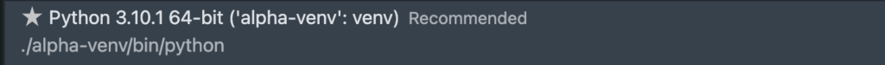

# A Complete Guide to Python Virtual Environments


In this tutorial, we’ll learn about Python virtual environments, the  benefits of using virtual environments, and how to work inside virtual  environments.

After you finish this tutorial, you’ll understand the following:

- What Python virtual environments are

- The benefits of working in virtual environments

- How to create, activate, deactivate, and delete virtual environments

- How to install packages in virtual environments and reproduce them on other systems

- How to use Python virtual environments in VS Code

  

Note: that this tutorial is mainly for macOS and Linux users; however, Windows users should also be able to follow along.

## What Are Python Virtual Environments?

A Python virtual environment consists of two essential components:  the Python interpreter that the virtual environment runs on and a folder containing third-party libraries installed in the virtual environment.  These virtual environments are isolated from the other virtual  environments, which means any changes on dependencies installed in a  virtual environment don’t affect the dependencies of the other virtual  environments or the system-wide libraries. Thus, we can create multiple  virtual environments with different Python versions, plus different  libraries or the same libraries in different versions.

[](https://www.dataquest.io/wp-content/uploads/2022/01/python-virtual-envs1.webp)

The figure above illustrates what you have on your system when we  create multiple Python virtual environments. As the illustration above  shows, a virtual environment is a folder tree containing a specific  Python version, third-party libraries, and other scripts; thus, there is no limitation on the number of virtual environments on a system because they are just folders containing some files.

## Why Are Python Virtual Environments Important?

The importance of Python virtual environments becomes apparent when  we have various Python projects on the same machine that depend on  different versions of the same packages. For example, imagine working on two different data visualization projects that use the matplotlib package, one using version 2.2 and the other using version 3.5. This  would lead to compatibility issues because Python cannot simultaneously  use multiple versions of the same package. The other use case that  magnifies the importance of using Python virtual environments is when  you’re working on managed servers or production environments where you  can’t modify the system-wide packages because of specific requirements.

Python virtual environments create isolated contexts to keep  dependencies required by different projects separate so they don’t  interfere with other projects or system-wide packages. Basically,  setting up virtual environments is the best way to isolate different  Python projects, especially if these projects have different and  conflicting dependencies. As a piece of advice for new Python programmers, always set up a separate virtual environment for each Python project,  and install all the required dependencies inside it — never install  packages globally.

## How to Use Python Virtual Environments

So far, we’ve learned what virtual environments are and why we need  them. In this part of the tutorial, we’ll learn how to create, activate, and (in general) work with virtual environments. Let’s get started!

### Creating a Python Virtual Environment

First make a project folder, and create a virtual environment inside  it. To do so, open the terminal app, write the following command, and  hit return.

```python
~ % mkdir alpha-prj
```

Now, use the `venv` command to create a virtual environment inside the project folder, as follows:

```python
~ % python3 -m venv alpha-prj/alpha-venv
```

------

**NOTE** There are two mains tools for setting up virtual environments, `virtualenv` and `venv`, that we can use almost interchangeably. `virtualenv` supports older Python versions and needs to be installed using the `pip` command. In contrast, `venv` is only used with Python 3.3 or higher and is included in the Python standard library, requiring no installation.

------

### Activating a Python Virtual Environment

To activate the virtual environment we created in the previous step, run the following command.

```python
~ % source alpha-prj/alpha-venv/bin/activate
```

As you’ve seen after activating the virtual environment, its name  appears in parentheses at the start of the terminal prompt. Running the  which `python` command is another way to ensure that the  virtual environment is active. If we run this command, it shows the  location of the Python interpreter within the virtual environment. Let’s check the location within the virtual environment.

```python
(alpha-venv) ~ % which python
/Users/lotfinejad/alpha-prj/alpha-venv/bin/python
```

It’s good to know that the Python version of the virtual environment  is the same as the Python version used for creating the environment.  Let’s check the Python version within the virtual environment.

```python
(alpha-venv) ~ % python —version
Python 3.10.1
```

Since I use Python 3.10 to set up the virtual environment, then the virtual environment uses exactly the same Python version.

### Installing Packages in a Python Virtual Environment

We are now inside an isolated virtual environment where only `pip` and `setup tools` are installed by default. Let’s check the pre-installed packages on the virtual environment by running the `pip list` command.

```python
(alpha-venv) ~ % pip list
Package    Version
---------- -------
pip        21.2.4
setuptools 58.1.0
```

Before we want to use `pip` to install any packages, let’s upgrade it to the latest version. Since we’re working inside the  virtual environment, the following command only upgrades the `pip` tool inside this environment, not in the other virtual environments or system-wide.

```python
(alpha-venv) ~ % alpha-prj/alpha-venv/bin/python3 -m pip install --upgrade pip
```

Let’s rerun the `pip list` command to see the changes.

```python
(alpha-venv) ~ % pip list
Package    Version
---------- -------
pip        21.3.1
setuptools 58.1.0
```

It’s clear that `pip` updated from version 21.2.4 to  21.3.1. Now, let’s install the pandas package into the environments.  Before installing the package, you need to decide which version to  install. If you’re going to install the latest version, you can simply  use the following command:

```python
(alpha-venv) ~ % python3 -m pip install pandas
```

But if you want to install a specific version of the package, you need to use this command:

```python
(alpha-venv) ~ % python3 -m pip install pandas==1.1.1
```

Now, let’s see how we can tell `pip` that we are going to install any version of pandas before version 1.2.

```python
(alpha-venv) ~ % python3 -m pip install 'pandas<1.2'
```

Also, we can ask `pip` to install the pandas package after version 0.25.3 as follows:

```python
(alpha-venv) ~ % python3 -m pip install 'pandas>0.25.3'
```

In the previous commands, we put the package specification between quotes, as greater than `>` and less than `<` signs have special meaning on the command-line shell. Both commands  will install the latest version of the pandas package that matches the  given constraints. However, the best practice is to specify packages  with an exact version number.

Let’s review the list of installed packages in the environment.

```python
(alpha-venv) ~ % pip list
Package         Version
--------------- -------
numpy           1.22.0
pandas          1.3.5
pip             21.3.1
python-dateutil 2.8.2
pytz            2021.3
setuptools      58.1.0
six             1.16.0
```

While installing pandas, NumPy and three other packages are automatically installed as prerequisites for the pandas package.

### Reproducing a Python Virtual Environment

It’s common to reproduce a virtual environment. Assume your colleague is going to work on the same project that you have been working on for  weeks. She needs to install exactly the same packages with the correct  versions in a virtual environment on her system. To create identical  environments, you first need to list all the dependencies installed in  the project’s virtual environment by using the `pip freeze` command.

```python
(alpha-venv) ~ % pip freeze
numpy==1.22.0
pandas==1.3.5
python-dateutil==2.8.2
pytz==2021.3
six==1.16.0
```

The output of `pip freeze` is quite similar to `pip list`, but it returns the list of packages installed on an environment in a  correct format to reproduce the environment with the exact package  versions the project requires. The next step is exporting the package  list into the `requirements.txt` file. To do so, run this command:

```python
(alpha-venv) ~ % pip freeze > requirements.txt
```

The command above creates a text file named `requirements.txt` in the current folder. The `requirements.txt` file contains all the packages and their exact versions. Let’s look at the file content.

```python
~ % cat requirements.txt
numpy==1.21.5
pandas==1.3.5
python-dateutil==2.8.2
pytz==2021.3
six==1.16.0
```

Well done, you’ve created a `requirements.txt` that you  can distribute to your colleague to reproduce the same virtual  environment on her system. Now, let’s see what she should do to  reproduce the virtual environment. It’s pretty simple. She first needs  to create a virtual environment, activate it, and then run the `pip install -r requirements.txt` command to install all the required packages.

She would run the following three commands:

```python
~ % python3 -m venv prj/venv
~ % source prj/venv/bin/activate
(venv) ~ % pip install -r requirements.txt
```

The last command installs all the packages listed in `requirements.txt` in the virtual environment that your colleague is creating. So, if she runs the `pip freeze` command on her side, she gets the same packages with the same versions  as yours. Another pertinent point to consider is that if you’re going to add your project to a Git repository, never add its virtual environment folder to the repository. The only thing you need to add is the `requirements.txt` file.

------

**NOTE** A Python project folder contains source code  that runs in a virtual environment. On the other hand, a virtual  environment is a folder that contains the Python interpreter, packages,  and tools like `pip`. So, the best practice is to keep them separate and never put your project files in a virtual environment folder.

------

### Deactivating a Python Virtual Environment

Once you are done working with a virtual environment, or you want to  switch to another virtual environment, you can deactivate an environment by running this command:

```python
(alpha-venv) ~ % deactivate
```

### Deleting a Python Virtual Environment

If you want to delete a virtual environment, you can simply delete its folder, no uninstall required.

```python
~ % rm -rf alpha-prj/alpha-venv
```

## How to Use Python Virtual Environments in Visual Studio Code

In this section, we will walk through using Python virtual  environments in VS Code. First, ensure you have created and activated a  virtual environment. Now navigate to your project folder in the  terminal, and run the following command:

```python
(alpha-venv) alpha-prj % code .
```

The command above will open the project folder in VS Code. If the  command above doesn’t work, open VS code, press command + shift + P, to  open the Command Palette, type shell command and select *Install ‘code’ command in PATH*. Now, create a Python file, and name it `my_script.py`. The last step is to select the virtual environment using the Python:  Select Interpreter command from the Command Palette. To do so, press  Command + shift + P, and type Python, and choose *Select Interpreter*.

The Python: Select Interpreter command displays all available  environments. The following image shows the environment that we need to  select.

[](https://www.dataquest.io/wp-content/uploads/2022/01/python-3.10.1-screenshot.webp)

At this point, if you open the integrated terminal in VS Code, you  will see that the virtual environment is active, and you can install any packages inside it.

------

In this tutorial, we learned how Python virtual environments avoid  conflicts between dependencies of different projects or system-wide.  Also, we learned how to work on distinct projects with different  dependencies by switching between these self-contained environments.