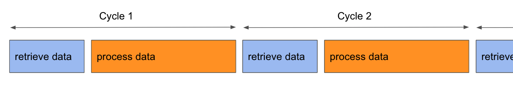
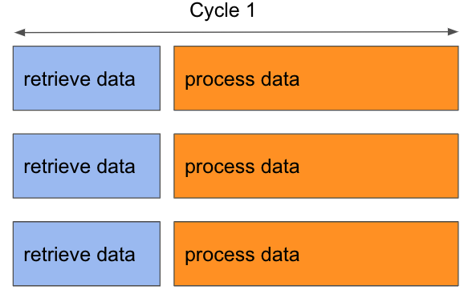

Threading
==============

# Getting started 
In a basic simple program, all actions are executed in sequence.<br>


To optimize processing time, it is more efficient to launch the processing in parallel.


This parallel execution is based on processes and threads which are flows of execution. 

# Existing solutions
There are many solution to do this in python.
1. os.fork
2. subprocess
3. async
4. multiprocessing
5. threading

All these solution will bring the same behaviour: there will be a moment where your code is no more a single flow of instruction but many flows at the same time.<br>
You can see it as a clone process.

## At the very beginning, there was os.fork
For the record, this is the oldest way to clone you rexecution flow.

```python
import os

x=os.fork()
if x:
    identity = "Darth Wader"
else:
    identity = "Luke"

print(identity)
```

This syntax becomes very complicated when you more than 2 threads...

## A much simple way 
Let use the [threading](https://docs.python.org/3/library/threading.html) package to declare threads.<br>

With this module, you will associate a thread to a standard function.<br>
To use a thread, you will have to follow these steps:
1. declare a function (thread main entry point)
2. create a thread ```threading.Thread(...)```
3. start the thread (a new flow begins)


```python {.line-numbers}
import threading
import time

# Thread entry point    ------> (1)
def thread_func(ttl):               
    # Retrieve current thread name
    name = threading.current_thread().getName()

    print('[Thread %s] starts' % (name))
    time.sleep(ttl)
    print('[Thread %s] diiied' % name)

if __name__ == "__main__":
    print("[Thread Main] start ---")

    # Declare threads    ------> (2)
    luke = threading.Thread(target=thread_func, name="luke", args=(5,)) 
    darthvader = threading.Thread(target=thread_func, name="darthvader", args=(10,))

    # Starts threads     ------> (3)
    luke.start()                   
    darthvader.start()

    # 3 threads running  ------> (4) 

    print("[Thread Main] end -----")
```

Before (3) there is only the ```main``` execution flow.
At (4) there is 3 separate flows:
- main -> continues 
- thread1 (luke)
- thread2 (darthvador)

Each flow leaves is own life after (3).


# Tricks
## Say my name


## Hidden multi threading
When you use some libraries or framework, the threads are hidden for you.<br>
For instance if you run a web server using flask, the framework will make it possible to manage many HTTP requests in parallel. However you didn't declare any thread or process.<br>
So be carefull when you debug, if you have breakpoints, be sure you are looking at the right thread.

## Deadlock, race conditions and other nice behaviours...
Paralell programming is very complex when you start sharing resources between your thread. You can face many issues related to data consistency, synchronization, communication or locks.<br>


